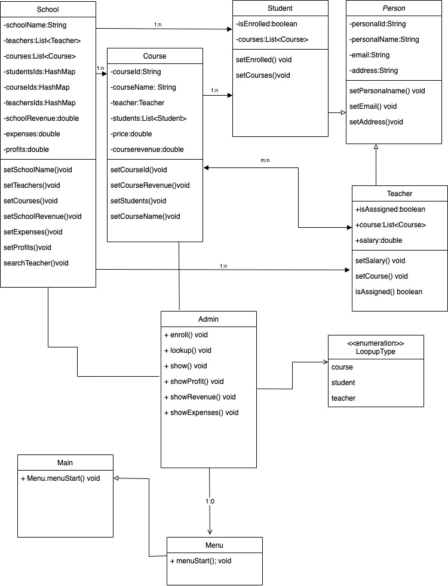

# IronSchool

IronSchool is a School Management System that helps manage students, teachers and courses with basic functionalities.

Check our [Application Guide](#Application-Guide) on how to use it.


## Tech Stack
- Java (v19)
- Oracle OpenJDK (v19.0.1)
- Maven (v4.0.0)
- JUnit (v4.13.2)


## Authors

- [@marnamrs](https://github.com/marnamrs)
- [@OxNordian](https://github.com/0xNordian)
- [@dga80](https://github.com/dga80)
- [@jordi92al](https://github.com/@jordi92al)
- [@estelcm](https://github.com/estelcm)


## Features

- No installs required ([check how to Run Locally](#run-locally))
- Runs in terminal
- Browsable management options
- Creation of records through terminal input


## Run Locally

Clone the project

```bash
  git clone https://github.com/PoderComputacional/ironschool
```

Install dependencies locally thorugh Maven and run project.


## Application Guide
Ironschool is an application that helps schools to manage their day-to-day by organizing the enrollment of students, assignment of teaching staff and creation of courses, as well as to keep track of the revenue and expenses both at a school level and at the course level. 

How it works:

#### 1. Setup

When running the application, it will prompt you to go through the necessary steps to `create` a school profile as well as require you to input how many instances of `courses`, `teachers` and `students` you want to create.

Once you fill in the required parameters for each instance, you will get visual confirmation of the data registered. Here is an example of the visualization after creating a teacher profile:

```bash
Teacher 1 name: Name Surname
Teacher 1 email: name@ironschool.com
Teacher 1 address: Test Blv. 01, City
Teacher 1 salary: 00.000
```

#### 2. Management

After completing the setup and creating all profiles for students, teachers and courses, the management menu will be automatically called in the terminal:

```bash
Enter command:
1) Enroll
2) Assign
3) Show
4) Lookup
5) Profit
6) Exit

```
Each option works as follows:

> [Enroll]

Allows you to enroll a `student` into a `course`. It requires entering both the `id` of the student and the course.

Enrolling a student in a course will automatically update the student profile, setting `isEnrolled` to true and adding the course to its `courses`.

Likewise, the course information will be updated to include the student in its enrollment list, and the `courseRevenue` will be recalculated.

> [Assign]

Allows you to assign a `teacher` to a `course`. It requires entering both the `id` of the teacher and the course.

Assigning a teacher to a course will automatically update the teacher profile, setting `isAssigned` to true and adding the course to its `courses`.

Likewise, the course information will be updated to include the teacher.

The application allows assignment of a teacher to multiple courses.

> [Show]

Allows you to select `courses`, `teachers` or `students` and returns a list of all elements in that category. 

> [Lookup]

Allows you to see the information stored for any given course, teacher or student.

It requires selecting whether you want to lookup a `course`, `teacher` or `student` and providing their `id`. 


> [Finance]

Allows you to check the current school revenue, expenses and profit.

`schoolProfit` is calculated substracting expenses (the sum of all teacher salaries) from revenue (the sum of the revenue of each course, calculated as price of course per student enrolled).

#### Class Diagram


